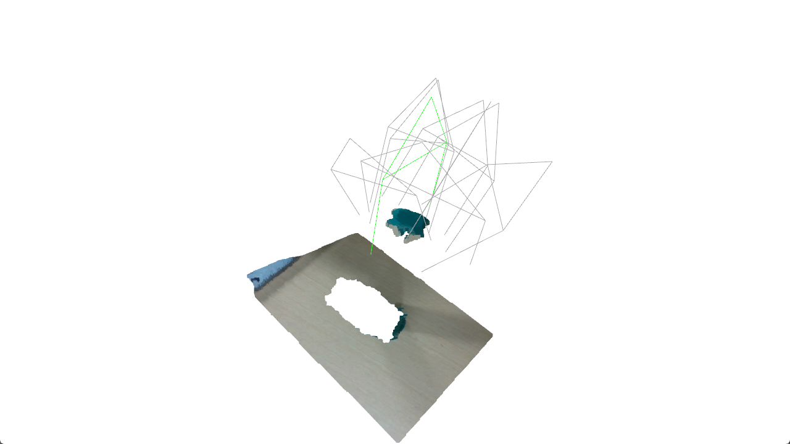
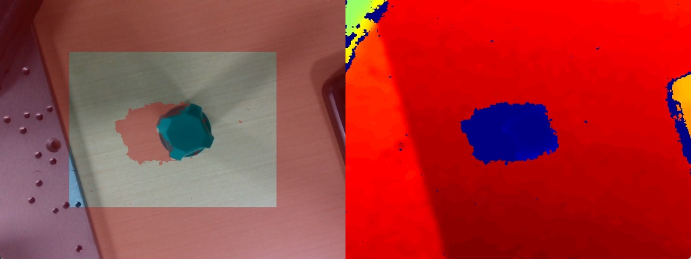
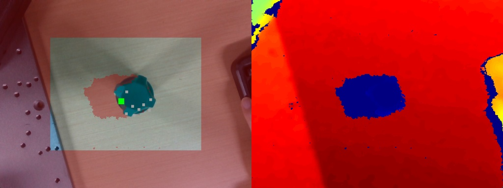

# GRASPNT

<p align="center">
  
</p>

<p align="center">
  
  
  
  
</p>

<p align="center">
  <b>简体中文</b> | <a href="README.md">English</a>
</p>

---

### 项目简介

GRASPNT 是一个完整的六自由度机械臂抓取系统，集成了 GraspNet 深度学习推理与实时机器人执行。系统使用 Intel RealSense D435i 深度相机进行 RGB-D 感知，使用 GraspNet 进行抓取位姿估计，使用 RealMan ECO65-6F 机械臂进行物理执行。采用 Python + C++ 分工架构：Python 负责视觉、推理和规划，C++ 负责机器人控制和运动执行，两者通过 UDP 通信。

### 目录

- [项目简介](#项目简介)
- [系统架构](#系统架构)
- [功能特性](#功能特性)
- [依赖项](#依赖项)
- [环境配置](#环境配置)
- [安装与构建](#安装与构建)
- [使用方法](#使用方法)
- [项目结构](#项目结构)
- [配置说明](#配置说明)
- [运行结果](#运行结果)
- [Star History](#star-history)
- [许可证](#许可证)

---

### 系统架构

```text
D435i RGB-D
  -> Python RealSense 采集
  -> Python 工作区预览（人工确认目标在工作区内）
  -> Python 通过 UDP 向 C++ 请求当前机械臂末端位姿
  -> Python GraspNet 推理 -> 相机坐标系下的抓取候选
  -> Python 选择最优候选
  -> Python 手眼变换 + 夹爪 TCP 偏移补偿
  -> Python 生成 base 坐标系下的 pre_grasp / grasp / lift 位姿
  -> Python 可视化 + 安全检查
  -> Python 通过 UDP 发送 grasp_execute
  -> C++ 解析、打印、等待本地 [y/N] 确认
  -> C++ 控制机械臂和夹爪执行抓取
```

### 功能特性

- **六自由度抓取位姿估计** — 基于 GraspNet 的推理，支持碰撞检测、NMS 和分数排序
- **RealSense D435i 集成** — 对齐的 RGB-D 采集，可配置分辨率和帧率
- **工作区预览** — 推理前实时相机画面，带深度叠加和工作区遮罩
- **手眼标定** — 可配置的相机到末端外参变换
- **夹爪 TCP 补偿** — 沿抓取方向自动校正夹爪长度偏移
- **Python + C++ 分离** — Python 负责视觉/规划，C++ 负责机器人控制
- **安全检查** — 双层验证：Python 检查几何/边界，C++ 检查逆解可达性和机器人状态
- **人在回路** — C++ 执行端在运动前需要本地控制台确认
- **抓取过程录像** — 自动保存抓取执行期间的 D435i 彩色视频
- **丰富可视化** — 2D RGB/深度叠加、3D 点云夹爪线框、调试文件导出（JSON、PLY、PNG）

### 依赖项

| 组件 | 依赖 | 用途 |
|------|------|------|
| Python | PyTorch | GraspNet 模型推理 |
| Python | Open3D | 点云处理、3D 可视化 |
| Python | pyrealsense2 | Intel RealSense D435i 驱动 |
| Python | NumPy, SciPy | 数值计算、旋转变换 |
| Python | OpenCV | 图像处理、视频录制 |
| Python | graspnetAPI | GraspNet 数据结构和评估工具 |
| Python | graspnet-baseline | GraspNet 模型、数据集工具、碰撞检测 |
| C++ | RealMan SDK (`api_cpp`) | RealMan ECO65-6F 机械臂控制 |
| C++ | nlohmann/json | UDP 协议 JSON 解析 |
| C++ | Winsock2 | UDP 套接字通信（Windows） |

### 环境配置

> 详细的图文安装教程请参考博客：[GraspNet + D435i + RealMan 机械臂抓取环境搭建](https://blog.csdn.net/SWORDHOLDER/article/details/159793585)

**前置要求：**
- **Visual Studio 2019** — 编译 `pointnet2` 和 `knn` 必须使用 VS2019，VS2022 及更高版本会导致编译错误。
- **CUDA Toolkit** — 版本需与安装的 PyTorch CUDA 版本匹配。

**Python 环境（Windows）：**

```bash
conda create -n graspnet python=3.8
conda activate graspnet
```

**安装 PyTorch**（需匹配 CUDA 版本，示例：CUDA 12.1）：

```bash
conda install pytorch==2.3.1 torchvision==0.18.1 torchaudio==2.3.1 pytorch-cuda=12.1 -c pytorch -c nvidia
```

**GraspNet baseline：**

```bash
git clone https://github.com/graspnet/graspnet-baseline.git
cd graspnet-baseline
# 重要：先注释掉 requirements.txt 中的 torch 行，然后：
pip install -r requirements.txt
```

编译安装 CUDA 扩展：

```bash
cd pointnet2
python setup.py install
cd ../knn
python setup.py install
```

> **注意：** 如果 `knn` 编译时遇到 `LNK2001` 链接错误，将 `knn` 目录下所有文件中的 `long` 替换为 `int64_t`，并在每个文件中添加 `#include <cstdint>`。

**graspnetAPI：**

```bash
git clone https://github.com/graspnet/graspnetAPI.git
cd graspnetAPI
# 重要：安装前将 setup.py 中的依赖 'sklearn' 改为 'scikit-learn'
pip install .
```

> **注意：** 如果遇到 `cannot import name 'container_abcs' from 'torch._six'` 错误，将相关文件中的导入改为使用 `collections.abc` 替代 `torch._six.container_abcs`。

**GraspNet 模型权重：**

从 [Google Drive](https://drive.google.com/file/d/1hd0G8LN6tRpi4742XOTEisbTXNZ-1jmk/view?usp=sharing) 或 [百度网盘](https://pan.baidu.com/s/1Eme60l39tTZrilF0I86R5A) 下载 RealSense 预训练权重，放置到 `graspnet-baseline/checkpoint-rs.tar`。

验证安装：

```bash
cd graspnet-baseline
python demo.py --checkpoint_path checkpoint-rs.tar
```

### 安装与构建

**C++ 执行端（Windows, Visual Studio）：**

```powershell
cd graspnt_robot_executor
mkdir build && cd build
cmake .. -DROBOTIC_ARM_DIR=path/to/Robotic_Arm
cmake --build . --config Release
```

CMake 期望的 RealMan SDK 目录结构：

```text
graspnt_robot_executor/
  3rdparty/
    Robotic_Arm/
      include/
        rm_service.h
      lib/
        api_cpp.lib
        api_cpp.dll
```

### 使用方法

1. **启动 C++ 执行端**（连接机器人，回 home，监听 UDP）：

```powershell
.\graspnt_robot_executor.exe
```

2. **启动 Python 抓取流程：**

```bash
python graspnt_rm/run_basic_grasp.py
```

3. **工作流程：**
   - Python 打开带工作区遮罩的实时相机预览
   - 按 **Space** 确认目标在工作区内并捕获当前帧
   - Python 运行 GraspNet 推理并显示 2D/3D 可视化
   - Python 通过 UDP 将抓取计划发送给 C++
   - C++ 打印计划，执行安全检查，询问 `Execute this grasp? [y/N]`
   - 输入 **y** 执行；机器人执行 pre_grasp -> grasp -> 闭合夹爪 -> 抬升 -> 回 home
   - 视频录像自动保存

### 项目结构

```text
GRASPNT/
  graspnt_rm/                  # Python 抓取流程
    run_basic_grasp.py         # 主入口
    camera_realsense.py        # RealSense D435i 采集
    graspnet_infer.py          # GraspNet 推理封装
    transform.py               # 手眼变换、位姿转换
    udp_client.py              # C++ 执行端 UDP 客户端
    safety.py                  # Python 侧安全验证
    visualization.py           # 工作区预览 + 调试可视化
    video_recorder.py          # 抓取过程录像
    config.py                  # YAML 配置加载器
    config.yaml                # 运行时配置

  graspnt_robot_executor/      # C++ 机器人执行服务端
    src/
      main.cpp                 # 入口，UDP 循环
      grasp_executor.cpp       # 抓取执行序列
      protocol.cpp             # JSON 协议解析
      robot_driver.cpp         # RealMan SDK 封装
      safety_checker.cpp       # C++ 安全验证
      udp_server.cpp           # UDP 服务端
    include/                   # 头文件

  graspnetAPI/                 # [依赖] 官方 GraspNet API
  graspnet-baseline/           # [依赖] 官方 GraspNet baseline 模型
```

### 配置说明

所有运行时参数在 `graspnt_rm/config.yaml` 中。主要配置段：

| 配置段 | 说明 |
|--------|------|
| `graspnet` | 模型权重路径、推理参数（num_point, num_view, collision_thresh, min_score） |
| `camera` | D435i 分辨率和帧率 |
| `hand_eye` | 手眼标定得到的相机到末端旋转和平移 |
| `workspace` | 图像区域遮罩（中心矩形比例） |
| `safety` | 夹爪长度、最低抓取高度、预抓取/抬升偏移、工作区边界 |
| `execution` | UDP 主机/端口、超时、重试次数 |
| `visualization` | 调试显示模式、保存选项、3D 渲染参数 |
| `recording` | 视频编码、帧率、输出目录 |

**重要：** 运行前请更新以下配置以匹配你的硬件环境：

- `graspnet.root` — 你的 `graspnet-baseline` 目录路径
- `graspnet.checkpoint` — 你的预训练权重文件路径
- `hand_eye.rotation` / `hand_eye.translation` — 你的手眼标定结果
- `safety.gripper_length` — 你的夹爪 TCP 到抓取接触点的距离
- `execution.udp_host` / `execution.udp_port` — 需与 C++ 执行端一致

以及 `graspnt_robot_executor/src/main.cpp` 中：

- `robot_ip` — RealMan 控制器 IP 地址（默认：`192.168.1.20`）
- `robot_port` — RealMan 控制器端口（默认：`8080`）
- `udp_port` — UDP 监听端口（默认：`6556`）

### 运行结果

以下是在 ECO65-6F 机械臂 + D435i 相机上的真实抓取执行结果。

#### 抓取执行视频

https://github.com/yakousansan/graspnet-robot-arm/raw/main/grasp_video.mp4


#### 工作区预览

<p align="center">
  
</p>

<p>推理前的实时预览：RGB 图像叠加深度伪彩色图，工作区外区域覆盖红色半透明遮罩。</p>

#### 2D 抓取可视化

<p align="center">
  
</p>

<p>2D RGB 辅助图，在图像上标记候选抓取中心。最优候选为绿色方块，其他候选为灰色方块。</p>

#### 3D 点云与抓取候选

<p align="center">
  
</p>

<p>3D 点云与夹爪线框。最优候选为绿色，其余为灰色。</p>

#### 关键执行日志

以下是一次真实抓取运行的关键日志摘录（Python 侧）：

```text
frame: {'color_shape': (480, 640, 3), 'depth_shape': (480, 640)}
grasp: {'valid_workspace_points': 101364, 'candidate_count': 9}

score: 0.225615
width: 0.067467

pre_grasp_pose: [-0.315860, 0.099039, 0.380548, -2.894357, -0.048547, -0.063852]
grasp_pose:     [-0.309602, 0.123161, 0.283703, -2.894357, -0.048547, -0.063852]
lift_pose:      [-0.309602, 0.123161, 0.383703, -2.894357, -0.048547, -0.063852]
```

C++ 执行端（UDP 通信与执行过程）：

```text
[UDP][RX] {"seq":1,"type":"pose_request","version":1}
[Executor] pose_request seq=1, reading robot state
[UDP][TX] end_pose=[-0.199184,0.183008,0.325757,3.141000,0.000000,-0.523000]
[UDP][TX] joint_deg=[149.996,0.005,90.001,0.000,-90.000,90.000]

[Executor] grasp_execute seq=2
[Command] seq=2, frame=base, unit=m_rad, score=0.225615, width=0.067467
[Command] pre_grasp_pose=[-0.315860, 0.099039, 0.380548, -2.894357, -0.048547, -0.063852]
[Command] grasp_pose=[-0.309602, 0.123161, 0.283703, -2.894357, -0.048547, -0.063852]
[Command] lift_pose=[-0.309602, 0.123161, 0.383703, -2.894357, -0.048547, -0.063852]
[UDP][TX] {"seq":2,"status":"accepted","type":"ack","version":1}
[Executor] Execute this grasp? [y/N]:
```

### Star History

[](https://star-history.com/#yakousansan/GRASPNT&Date)

### 许可证

本项目仅供研究和教育用途。请参阅 GraspNet、graspnetAPI 和 RealMan SDK 的各自许可证。
